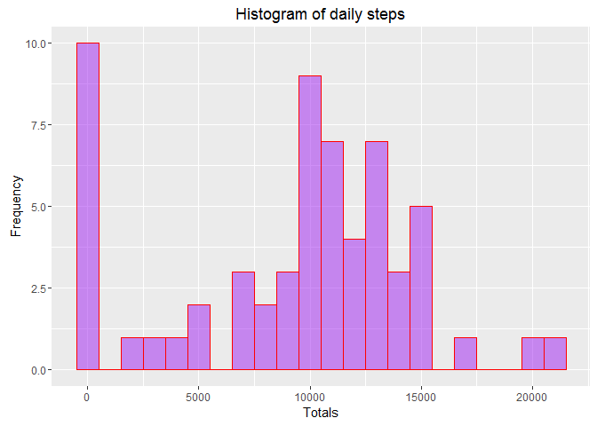
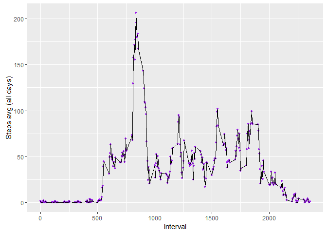

# Reproducible Research: Peer Assessment 1


```r
library(ggplot2)
library(dplyr)
```

```
## 
## Attaching package: 'dplyr'
```

```
## The following objects are masked from 'package:stats':
## 
##     filter, lag
```

```
## The following objects are masked from 'package:base':
## 
##     intersect, setdiff, setequal, union
```


```r
knitr::opts_chunk$set(cache=TRUE)

## Loading and preprocessing the data
  # read in the data
  data <- read.csv(file = file.choose(), header = TRUE, sep = ',', colClasses = c("numeric", "character", "integer")) 


  # check how things look
  head(data)
```

```
##   steps       date interval
## 1    NA 2012-10-01        0
## 2    NA 2012-10-01        5
## 3    NA 2012-10-01       10
## 4    NA 2012-10-01       15
## 5    NA 2012-10-01       20
## 6    NA 2012-10-01       25
```

```r
  # check column types
  sapply(data, class)
```

```
##       steps        date    interval 
##   "numeric" "character"   "integer"
```

```r
  # fix date stored as character
  data$date <- as.Date(data$date)
```

## What is mean total number of steps taken per day?


```r
  # calculate the total number of steps taken per day
  byDate <- group_by(data, date)
  stepsByDate <- summarise(byDate, sumSteps = sum(steps, na.rm=TRUE), countSteps = n())


  # make a histogram of the total number of steps taken each day
  ggplot(stepsByDate, aes(x = sumSteps)) +
    geom_histogram(binwidth=1000, alpha=.5, position="identity", fill="purple", col="red") +
    ggtitle ("Histogram of daily steps") +
    xlab ("Totals") +
    ylab ("Frequency")
```

<!-- -->

```r
  # calculate and report the mean and meadian of the total number of steps taken per day
    # mean
    meanMedian <- stepsByDate %>%
      #filter(!is.na(sumSteps)) %>%
      summarise(
        mean=mean(sumSteps, na.rm=TRUE),
        median = median(sumSteps, na.rm=TRUE)
      )

    meanMedian
```

```
## # A tibble: 1 × 2
##      mean median
##     <dbl>  <dbl>
## 1 9354.23  10395
```

## What is the average daily activity pattern?


```r
  # make a time-series plot (type = "l") of the 5-minute interval (x-axis) and the average number of steps taken, averaged across all days (y-axis)
  avgDailyPattern <- data %>%
    group_by(interval) %>%
    #filter(!is.na(steps)) %>%
    summarize(avgStepsPer = mean(steps, na.rm=TRUE))

  ggplot(avgDailyPattern,
    aes(x = interval, y = avgStepsPer)) +
    geom_point(color = "purple", size = 1) +
    geom_line(color = "black", size = .5) +
    xlab ("Interval") +
    ylab ("Steps avg (all days)")
```

<!-- -->

```r
  # which 5-minute interval, on average across all the days in the dataset, contains the maximum number of steps?
  maxSteps <- avgDailyPattern %>%
    filter(avgStepsPer == max(avgStepsPer))
  
  maxSteps
```

```
## # A tibble: 1 × 2
##   interval avgStepsPer
##      <int>       <dbl>
## 1      835    206.1698
```

## Imputing missing values


## Are there differences in activity patterns between weekdays and weekends?
