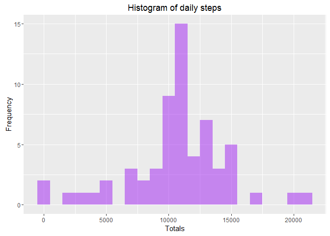
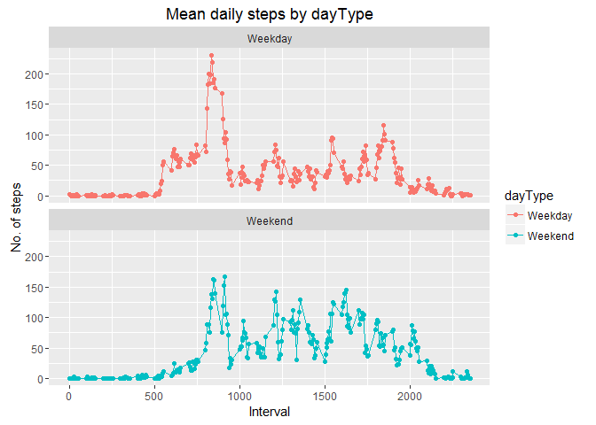
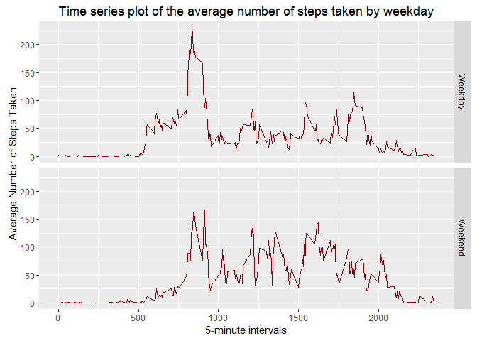

# Reproducible Research: Peer Assessment 1


```r
library(ggplot2)
library(dplyr)
```

```
## 
## Attaching package: 'dplyr'
```

```
## The following objects are masked from 'package:stats':
## 
##     filter, lag
```

```
## The following objects are masked from 'package:base':
## 
##     intersect, setdiff, setequal, union
```


```r
knitr::opts_chunk$set(cache=TRUE)

## Loading and preprocessing the data
  # read in the data
  data <- read.csv(file = file.choose(), header = TRUE, sep = ',', colClasses = c("numeric", "character", "integer")) 


  # check how things look
  head(data)
```

```
##   steps       date interval
## 1    NA 2012-10-01        0
## 2    NA 2012-10-01        5
## 3    NA 2012-10-01       10
## 4    NA 2012-10-01       15
## 5    NA 2012-10-01       20
## 6    NA 2012-10-01       25
```

```r
  # check column types
  sapply(data, class)
```

```
##       steps        date    interval 
##   "numeric" "character"   "integer"
```

```r
  # fix date stored as character
  data$date <- as.Date(data$date)
```

## What is mean total number of steps taken per day?


```r
  # calculate the total number of steps taken per day
  byDate <- group_by(data, date)
  stepsByDate <- summarise(byDate, sumSteps = sum(steps, na.rm=TRUE), countSteps = n())


  # make a histogram of the total number of steps taken each day
  ggplot(stepsByDate, aes(x = sumSteps)) +
    geom_histogram(binwidth=1000, alpha=.5, position="identity", fill="purple", col="red") +
    ggtitle ("Histogram of daily steps") +
    xlab ("Totals") +
    ylab ("Frequency")
```

<!-- -->

```r
  # calculate and report the mean and meadian of the total number of steps taken per day
    # mean
    meanMedian <- stepsByDate %>%
      #filter(!is.na(sumSteps)) %>%
      summarise(
        mean=mean(sumSteps, na.rm=TRUE),
        median = median(sumSteps, na.rm=TRUE)
      )

    meanMedian
```

```
## # A tibble: 1 × 2
##      mean median
##     <dbl>  <dbl>
## 1 9354.23  10395
```

## What is the average daily activity pattern?


```r
  # make a time-series plot (type = "l") of the 5-minute interval (x-axis) and the average number of steps taken, averaged across all days (y-axis)
  avgDailyPattern <- data %>%
    group_by(interval) %>%
    #filter(!is.na(steps)) %>%
    summarize(avgStepsPer = mean(steps, na.rm=TRUE))

  ggplot(avgDailyPattern,
    aes(x = interval, y = avgStepsPer)) +
    geom_point(color = "purple", size = 1) +
    geom_line(color = "black", size = .5) +
    xlab ("Interval") +
    ylab ("Steps avg (all days)")
```

<!-- -->

```r
  # which 5-minute interval, on average across all the days in the dataset, contains the maximum number of steps?
  maxSteps <- avgDailyPattern %>%
    filter(avgStepsPer == max(avgStepsPer))
  
  maxSteps
```

```
## # A tibble: 1 × 2
##   interval avgStepsPer
##      <int>       <dbl>
## 1      835    206.1698
```

## Imputing missing values


```r
  # calculate and report the total # of missing values in the dataset (NAs)
    # method 1    
    sum(is.na(data)) #2304
```

```
## [1] 2304
```

```r
    # method 2
    nrow(data[is.na(data$steps),]) #2304
```

```
## [1] 2304
```

```r
    # method 3
    missing<-is.na(data$steps) #2304
    sum(missing)
```

```
## [1] 2304
```

```r
    # method 4
    sapply(data, function(X) sum(is.na(X)))
```

```
##    steps     date interval 
##     2304        0        0
```

```r
  # devise a strategy for filling in all of the missing values in the dataset
    # method 1
    data2 <- data # 'data' is original
    nas <- is.na(data2$steps)
    avg_interval<- tapply(data2$steps, data2$interval, mean, na.rm=TRUE, simplify = TRUE)
    data2$steps[nas] <- avg_interval[as.character(data2$interval[nas])]
    #data2 is now clean
    
      # check for na in new data
      sum(is.na(data2)) #0
```

```
## [1] 0
```

```r
  # create a new dataset that is equal to the original dataset but with the missing data filled in
    # see either data2 or clean_data above
      
  # make a histogram of the total number of steps taken each day and 
    # Calculate and report the mean and median total number of steps taken per day.
      byDate2 <- group_by(data2, date)
      stepsByDate2 <- summarise(byDate2, sumSteps = sum(steps, na.rm=TRUE), countSteps = n())
      
      # make a histogram of the total number of steps taken each day
      ggplot(stepsByDate2, aes(x = sumSteps)) +
        geom_histogram(
          binwidth=1000
          , alpha=.5
          , position="identity"
          , fill="purple"
          #, col="red"
          ) +
        ggtitle ("Histogram of daily steps") +
        xlab ("Totals") +
        ylab ("Frequency")
```

<!-- -->

```r
      # calculate and report the mean and meadian of the total number of steps taken per day
      # mean
      meanMedian2 <- stepsByDate2 %>%
        #filter(!is.na(sumSteps)) %>%
        summarise(
          mean=mean(sumSteps, na.rm=TRUE),
          median = median(sumSteps, na.rm=TRUE)
        )
      
      meanMedian2
```

```
## # A tibble: 1 × 2
##       mean   median
##      <dbl>    <dbl>
## 1 10766.19 10766.19
```

```r
      meanMedian
```

```
## # A tibble: 1 × 2
##      mean median
##     <dbl>  <dbl>
## 1 9354.23  10395
```

```r
      meanMedian - meanMedian2
```

```
##        mean    median
## 1 -1411.959 -371.1887
```

```r
    # Do these values differ from the estimates from the first part of the assignment? 
      # yes 
      
    # What is the impact of imputing missing data on the estimates of the total daily number of steps?
      # the mean now = the median
```
            
## Are there differences in activity patterns between weekdays and weekends?


```r
  # may want to use weekdays() function
      
  # create a new factor variable in the dataset with two levels - "weekday" and "weekend" indicating whether a given date is a weekday or weekend day
    # method 1
    data2 <- data2 %>%
      mutate(dayType = ifelse(weekdays(data2$date) == "Saturday" | weekdays(data2$date) == "Sunday", "Weekend", "Weekday"))
    
    # method 2
    data2 <- data2 %>%
      mutate(dayType = ifelse(weekdays(data2$date) %in% c("Saturday", "Sunday"), "Weekend", "Weekday"))
    
    head(data2)
```

```
##       steps       date interval dayType
## 1 1.7169811 2012-10-01        0 Weekday
## 2 0.3396226 2012-10-01        5 Weekday
## 3 0.1320755 2012-10-01       10 Weekday
## 4 0.1509434 2012-10-01       15 Weekday
## 5 0.0754717 2012-10-01       20 Weekday
## 6 2.0943396 2012-10-01       25 Weekday
```

```r
  # make a panel plot containing a time-series plot (type = "l") of the 5-minute interval (x-axis) and the average number of steps taken, averaged across
  # all weekdays or weekend days (y-axis)
  daySlice <- data2 %>%
    group_by(interval, dayType) %>%
    summarise(avg_steps2 = mean(steps, na.rm = TRUE))

    # method 1
    ggplot(daySlice, aes(x = interval , y = avg_steps2, color = dayType)) +
      geom_line() +
      geom_point() +
      labs(title = "Mean daily steps by dayType", x = "Interval", y = "No. of steps") +
      facet_wrap(~dayType, ncol = 1, nrow = 2)
```

<!-- -->

```r
    # method 2
    ggplot(daySlice, aes(x = interval , y = avg_steps2)) +
      geom_line(size=.7, position="identity", color = "darkred") +
      facet_grid(dayType ~ .)+
      ggtitle ("Time series plot of the average number of steps taken by weekday") +
      xlab("5-minute intervals") +
      ylab(" Average Number of Steps Taken")
```

<!-- -->

